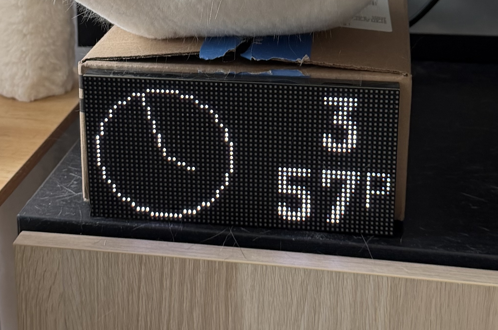
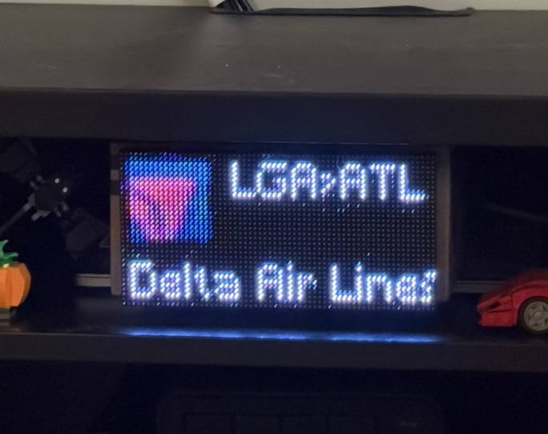

# Minitron LED Panel API

A custom backend API for the [Minitron LED Panel](https://github.com/sanjito31/minitron-hdk) hardware project. This API fetches, processes, and renders various information sources as WebP images optimized for a 64x32 LED matrix display.

## Screenshots

| Clock | Weather | Flights Overhead |
|-------|---------|------------------|
|  |  |  |

## Features

### Clock
A simple digital clock display showing current time with animated second hand.

### Weather
Location-specific weather information including current conditions and temperature. Weather icons are rendered based on conditions. Data sourced from the OpenWeatherMap API.

### NYC MTA Subway
Real-time NYC subway arrival times for configurable stations and lines. Currently configured for B/D/F/M lines with uptown and downtown wait times. Uses the official MTA GTFS real-time feed.

### Flights Overhead
Identifies aircraft currently flying above your location using the OpenSky Network API. Displays flight number, airline logo, and route information (origin/destination airports). Supports logos for major airlines including American, Delta, United, Southwest, and Spirit.

### Spotify (In Development)
Currently playing track information from Spotify.

### F1 (Planned)
Formula 1 World Driver's and Constructor's Championship standings via FastF1/Ergast.

## Project Structure

```
minitron-led-panel-api/
├── main.py              # FastAPI application entry point
├── config.py            # Environment configuration using Pydantic
├── apps/                # Individual display apps
│   ├── Clock.py         # Clock display
│   ├── Weather.py       # Weather display
│   ├── MTA.py           # NYC Subway times
│   └── FlightsOverhead.py  # Flight tracking
├── models/
│   ├── App.py           # Base app model
│   └── Carousel.py      # App rotation logic
├── utils/
│   ├── draw.py          # Drawing utilities
│   └── TimeKeeper.py    # Timing utilities
├── assets/
│   ├── airline_logos/   # Airline logo images
│   └── weather/         # Weather condition icons
├── Dockerfile
├── docker-compose.yaml
└── requirements.txt
```

## Prerequisites

- Python 3.13+
- Docker (optional, for containerized deployment)

## Environment Variables

Create a `.env` file in the project root with the following variables:

```env
# Weather (OpenWeatherMap)
OPEN_WEATHER_API_KEY=your_openweathermap_api_key
LAT=your_latitude
LON=your_longitude

# Flight tracking bounding box (OpenSky Network)
LATMIN=min_latitude
LATMAX=max_latitude
LOMIN=min_longitude
LOMAX=max_longitude

# Spotify (optional)
SPOTIFY_CLIENT_ID=your_spotify_client_id
SPOTIFY_CLIENT_SECRET=your_spotify_client_secret
SPOTIFY_REDIRECT_URI=your_redirect_uri
```

## Installation

### Local Development

1. Clone the repository:
   ```bash
   git clone https://github.com/sanjito31/minitron-led-panel-api.git
   cd minitron-led-panel-api
   ```

2. Create and activate a virtual environment:
   ```bash
   python -m venv .venv
   source .venv/bin/activate  # On Windows: .venv\Scripts\activate
   ```

3. Install dependencies:
   ```bash
   pip install -r requirements.txt
   ```

4. Create your `.env` file with the required environment variables.

5. Run the development server:
   ```bash
   python main.py
   ```

   Or with uvicorn directly:
   ```bash
   uvicorn main:server --reload --host 0.0.0.0 --port 8000
   ```

### Docker Deployment

1. Build and run with Docker Compose:
   ```bash
   docker-compose up --build
   ```

   Or build manually:
   ```bash
   docker build -t minitron-api .
   docker run -p 8000:8000 -v .:/app minitron-api
   ```

## API Endpoints

| Endpoint | Method | Description |
|----------|--------|-------------|
| `/api/current` | GET | Returns the current carousel frame as a WebP image |
| `/api/test` | GET | Returns the weather app frame for testing |
| `/api/logs` | POST | Accepts log entries from the hardware device |

The `/api/current` endpoint automatically rotates through enabled apps based on their configured TTL (time-to-live) values.

## Tech Stack

- **FastAPI** - Web framework for building the API
- **Uvicorn** - ASGI server
- **Pillow** - Image generation and manipulation
- **Pydantic** - Settings and data validation
- **Requests** - HTTP client for external APIs
- **GTFS Realtime Bindings** - Parsing MTA subway data
- **Spotipy** - Spotify API integration
- **Docker** - Containerized deployment

## External APIs

- [OpenWeatherMap](https://openweathermap.org/api) - Weather data
- [MTA GTFS Feeds](https://api.mta.info/) - NYC Subway real-time data
- [OpenSky Network](https://opensky-network.org/apidoc/) - Flight tracking data
- [ADSBdb](https://www.adsbdb.com/) - Aircraft and flight route information

## Hardware Companion

This API is designed to work with the [Minitron LED Panel](https://github.com/sanjito31/minitron-hdk) hardware project, which handles fetching frames from this API and displaying them on a 64x32 RGB LED matrix.

---

Inspired by [tidbyt.com](https://tidbyt.com)

**Disclaimer:** This project is not affiliated with or endorsed by Tidbyt.